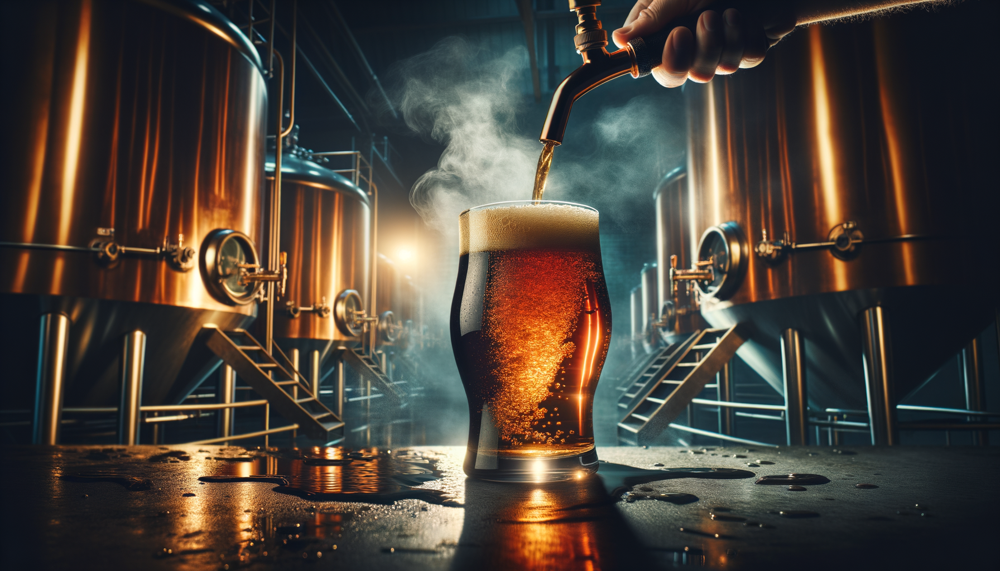

# 🍺 Nelson Ripper · TecnoBeer

> **Portafolio personal de Nelson Ripper** — artesano cervecero y fundador de TecnoBeer.  
> Donde la ciencia se convierte en sabor.

[](https://nextjs.org/)
[](https://www.typescriptlang.org/)
[](https://tailwindcss.com/)
[](https://vercel.com/)
[](LICENSE)

---

## 🌐 Demo en Vivo

**[nelson-ripper.vercel.app](https://nelson-ripper.vercel.app)**

---

## 📸 Preview

| Hero | Especialidades | Proceso |
|------|---------------|---------|
|  | Amber + IPA + Stout + Wheat | Timeline interactivo |

---

## ✨ Features

- 🎨 **Diseño dark premium** — colores ámbar, carbón y cobre
- 📱 **Totalmente responsive** — mobile-first
- ⚡ **Next.js App Router** — performance óptimo
- 🖼️ **next/image** — imágenes optimizadas automáticamente
- 🎬 **Animaciones on-scroll** — Intersection Observer API
- 🕹️ **Easter egg** — pixel art de Nelson del juego Radar Fighters

---

## 🛠️ Stack Técnico

| Tecnología | Uso |
|-----------|-----|
| [Next.js 14](https://nextjs.org/) | Framework React (App Router) |
| [TypeScript](https://www.typescriptlang.org/) | Type safety |
| [Tailwind CSS](https://tailwindcss.com/) | Estilos utilitarios |
| [Google Fonts](https://fonts.google.com/) | Playfair Display + Inter |
| [Vercel](https://vercel.com/) | Deploy & hosting |

---

## 🚀 Desarrollo Local

```bash
# 1. Clonar el repo
git clone https://github.com/christiangfv/nelson-ripper-portfolio.git
cd nelson-ripper-portfolio

# 2. Instalar dependencias
npm install

# 3. Correr en dev
npm run dev
```

Abre [http://localhost:3000](http://localhost:3000) en tu browser.

---

## 📦 Build & Deploy

```bash
# Build de producción
npm run build

# Deploy a Vercel (requiere vercel CLI)
vercel --prod
```

El proyecto está configurado para deploy automático en Vercel con cada push a `main`.

---

## 📁 Estructura

```
nelson-ripper-portfolio/
├── public/
│   └── images/
│       ├── hero-beer.png        # Hero cinematic (AI generated)
│       ├── nelson-portrait.png  # Retrato del artesano (AI generated)
│       └── char_nelson.png      # Pixel art de Nelson (Radar Fighters)
├── src/
│   └── app/
│       ├── layout.tsx           # Layout + metadata
│       ├── page.tsx             # Página principal (single-page)
│       └── globals.css          # Estilos globales + animaciones
├── next.config.ts
└── README.md
```

---

## 🍺 Secciones

1. **Hero** — Full-viewport con imagen y CTA
2. **Sobre Mí** — Bio + highlights de Nelson
3. **Especialidades** — 4 estilos de cerveza artesanal
4. **El Proceso** — Timeline: ingredientes → fermentación → embotellado
5. **Easter Egg** — 🕹️ Nelson el luchador (pixel art)
6. **Contacto** — Email + Instagram
7. **Footer** — © 2026 TecnoBeer

---

## 👤 Sobre Nelson Ripper

Cervecero artesanal chileno, fundador de **TecnoBeer**. Apasionado por crear experiencias únicas en cada sorbo, combinando técnica científica con tradición artesanal. Más de 5 años elaborando recetas únicas: IPA Tropical, Amber Ale, Stout Oscura y Wheat Beer.

---

## 📄 Licencia

MIT — úsalo, fórkalo, compártelo. 🍺

---

*Made with ❤️ and 🍺 — [christiangfv](https://github.com/christiangfv)*
